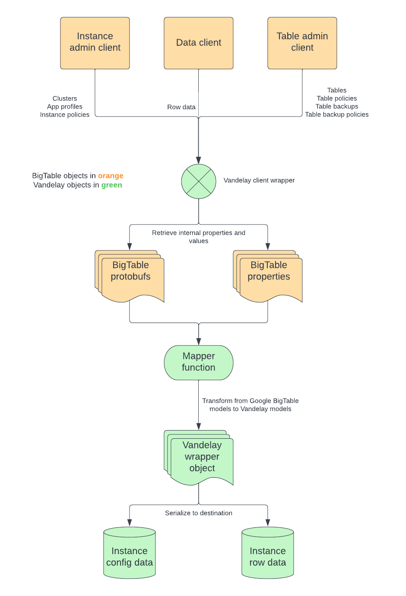
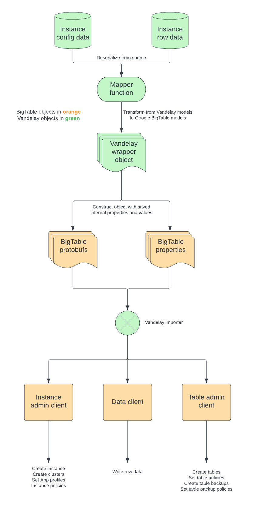

# Vandelay
## _An Importer/Exporter for BigTable_


A small library for BigTable instance and data management. Vandelay allows you to export the full configuration of a BigTable instance and data for all rows present in every table. Instance configurations and table data an also be imported to recreate BigTable instances as they were at the time of export.

## Features

- Capture all configuration information for an instance (clusters, backups, app profiles, IAM policies)
- Capture all information for tables
-- Row keys, column family, qualifiers, timestamps, values, labels, IAM policies, table backups
- Export data and automatically delete BigTable instances
- Import data and automatically (re)create BigTable instances from a saved export configuration
- SLF4J integration for customized logging
- Lightweight with minimal dependencies

## Getting Started

Include the latest version of Vandelay into your project ([Maven][maven]):
```xml
<dependency>
  <groupId>com.spotify</groupId>
  <artifactId>vandelay-bigtable</artifactId>
  <version>{latest.version.here}</version>
</dependency>
```

## Overview

Vandelay provides a simple set of APIs to perform a full export and import of BigTable instances. The project is split across several modules to allow for better customization and future extensibility for other databases. As it stands, the project heirarchy is as follows:
- `vandelay-core`: Common set of interfaces and objects used by the other modules. These can be extended/implemented to support other database types.
- `vandelay-serialization-core`: Common set of interfaces, objects, and utility classes to support serialization. These can be extended/implemented to support custom serialization of database configurations and row data.
- `vandelay-serialization-jackson`: A wrapper around Jackson that supports JSON serialization.
- `vandelay-bigtable`: A library that exposes APIs for exporting and importing a BigTable instance.
- `vandelay-bigtable-demo`: A demo project that has a sample implementation for exporting and importing a BigTable instance using the `vandelay-bigtable` library.

### Architecture

### Exporting

The export flow is shown in the diagram below.



### Importing

The import flow is shown in the diagram below.



## Usage

### Exporting an instance

Before beginning an export, verify that your GCP credentials have the appropriate IAM permissions. 

The export process requires several steps to set up the export process. These steps are explained in further detail below. There is a `vandelay-bigtable-demo` project that contains a command-line demo project for exporting and importing a BigTable instance.

1. Create an export configuration
2. Create the BigTable admin and data client wrapper
3. Create the exporter
4. Subscribing to receive export messages
5. Running the exporter
6. Saving the configuration and row data

### Create an export configuration

An export configuration is the configuration that the exporter uses to perform the export. This configuration contains four options that must be specified
```java
  public VandelayBigTableExportConfiguration(
    /* Project ID where the BigTable instance resides */
    final String projectId,
    /* Instance ID of the BigTable instance */
    final String instanceId,
    /* True if the instance should be deleted after exporting */
    final boolean deleteOnExport,
    /* True if the export should be multi-threaded */
    final boolean parallelExport)
````

Instantiating an export configuration simply requires creating an instance of the export configuration
```java
  final VandelayBigTableExportConfiguration configuration =
    new VandelayBigTableExportConfiguration(projectId, instanceId, false, false);
```

### Create the BigTable admin and data client wrapper

This class wraps the BigTable admin and data clients and is passed to the exporter. Simply create an instance as it requires no configuration.
```java
  final VandelayBigTableClient client = new VandelayBigTableClient();
```

### Create the exporter

With the configuration and client wrapper created, the exporter is now ready to instantiate. The exporter takes in the client wrapper as its only argument
```java
  final VandelayBigTableExporter exporter = new VandelayBigTableExporter(client);
```

### Subscribing to receive export messages

The exporter will emit messages when certain events happen during the export process. These events will be wrapped in a `VandelayBigTableExportEvent` object containing the specific event object that was emitted. There are four type of export events defined in `VandelayBigTableExportEvent`
```java
  /* A row has been exported */
  private VandelayEvent<VandelayBigTableRow> rowExportEvent;
  
  /* A BigTable instance configuration has been exported */
  private VandelayEvent<VandelayBigTableGCPConfiguration> infoEvent;
  
  /* An export has finished */
  private VandelayEvent<VandelayBigTableRowsExportFinishedEvent> exportFinishedEvent;
  
  /* A BigTable instance has been deleted */
  private VandelayEvent<VandelayBigTableDeleteInstanceEvent> deleteInstanceEvent;
```

To subscribe to receive events, register as a listener after instantiating the exporter. You can then handle any events that you are interested in. At a basic level, a handler can look like the following:
```java
  final VandelayBigTableRowBatch rows = new VandelayBigTableRowBatch();
  exporter.addListener(
    event -> {
      if (event.getInfoEvent().isPresent()) {
        // Handle instance information event
      } else if (event.getRowExportEvent().isPresent()) {
        // Handle row export event
      } else if (event.getExportFinishedEvent().isPresent()) {
        // Handle export finished event
      } else if (event.getDeleteEvent().isPresent()) {
        // Handle delete instance event
      }
    });
```

### Running the exporter

After subscribing to receive the export messages, the export process can begin. This happens with a call to `exportTo`
```java
  final Status exportStatus = exporter.exportTo(configuration);
```
### Saving the configuration and row data

The last step is to save the information that is exported from the BigTable instance: the instance configuration and the row data. Instance configuration information is provided in a `VandelayBigTableGCPConfiguration` object and row information is provided in a `VandelayBigTableRow` object (see above). After subscribing to listen to events from the exporter, you can serialize these objects in any format of your choosing. There is a `VandelayJacksonSerializer` provided in the `vandelay-serialization-jackson` project that allows you to serialize and deserialize from JSON.
To perform serialization, instantiate a `VandelayJacksonSerializer` instance, call the `serialize` method with the desired object, and save the resulting content to a file.

```java
  final VandelayJacksonSerializer<VandelayBigTableGCPConfiguration> serializer =
    new VandelayJacksonSerializer<>();
  final String config = serializer.serialize(event.getInfoEvent().get().getValue());
  writeToFile(configOutputPath, config);
    
  ...
    
  final VandelayJacksonSerializer<VandelayBigTableRowBatch> serializer =
    new VandelayJacksonSerializer<>();
  final String data = serializer.serialize(rows);
  writeToFile(dataOutputPath, data);
```

### Importing an instance

Once you have a configuration and row data file, you can perform an import. This will re-create the BigTable instance as it was and populate it with the row data for each table.

The import process is as follows; the steps are mostly the reverse of the export process. As with exporting, you can reference the `vandelay-bigtable-demo` project for a command-line demo project for exporting and importing a BigTable instance.

1. Read and deserialize the instance configuration
2. Read and deserialize the row data
3. Create an import configuration
4. Create the BigTable admin and data client wrapper
5. Create the importer
6. Import the instance configuration
7. Import the row data

### Read and deserialize the instance configuration

Once you have a serialized configuration file, you can simply read it in and deserialize it back into a `VandelayBigTableGCPConfiguration` object. The serialization format is at the user's discretion, but this project provides a default JSON serializer in the `VandelayJacksonSerializer` class. To deserialize, instantiate the `VandelayJacksonSerializer` and call the `deserialize` method.
```java
  final VandelayJacksonSerializer<VandelayBigTableGCPConfiguration> configSerializer =
    new VandelayJacksonSerializer<>();
  final String configContent = Files.readString(Path.of(configInputPath));
  final VandelayBigTableGCPConfiguration config =
    configSerializer.deserialize(configContent, VandelayBigTableGCPConfiguration.class);
```

### Read and deserialize the row data

Reading and deserializing the row data follows the same process as above: simply instantiate the serialize and deserialize the content
```java
  final VandelayJacksonSerializer<VandelayBigTableRowBatch> dataSerializer =
    new VandelayJacksonSerializer<>();
  final String dataContent = Files.readString(Path.of(dataInputPath));
  final VandelayBigTableRowBatch rowBatch =
    dataSerializer.deserialize(dataContent, VandelayBigTableRowBatch.class);
```

### Create an import configuration

Once you have a deserialized configuration in a `VandelayBigTableGCPConfiguration` object, you can create an import configuration with it. Like the export configuration, the import configuration contains several options that must be specified
```java
  public VandelayBigTableImportConfiguration(
    /* Project ID where the BigTable instance resides */
    final String projectId,
    /* Instance ID of the BigTable instance */
    final String instanceId,
    /* The instance configuration that was exported */
    final VandelayBigTableGCPConfiguration gcpConfiguration,
    /* True to create the instance if it doesn't exist already */
    final boolean createInstanceIfDoesntExist,
    /* True to create tables if they don't exist */
    final boolean createTableIfDoesntExist)
```

The import configuration is instantiated as follows:
```java
  final VandelayBigTableImportConfiguration importConfiguration =
    new VandelayBigTableImportConfiguration(projectId, instanceId, config, true, true);
```

### Create the BigTable admin and data client wrapper

This class wraps the BigTable admin and data clients and is passed to the importer. Simply create an instance as it requires no configuration.
```java
  final VandelayBigTableClient client = new VandelayBigTableClient();
```

### Create the importer

With the configuration and client wrapper created, the importer is now ready to instantiate. The importer takes in the client wrapper as its only argument
```java
  final VandelayBigTableImporter importer = new VandelayBigTableImporter(client);
```

### Import the instance configuration

Before importing row data, the instance configuration should be imported so that the BigTable instance can be recreated as it was. To perform this step of the import process, simply pass in the created `VandelayBigTableImportConfiguration` to the importer's `importFrom` method.
```java
  final Status status = importer.importFrom(importConfiguration);
```

if the result in `Status` is successful, then the BigTable instance has been recreated. At this point, the import of the row data can begin.

### Import the row data

Importing the row data is the last step in the import process. The importer defines an `addRows` method to do this, which takes in two arguments
```java
  public Status addRows(
    /* The import configuration for the BigTable instance */
    final VandelayBigTableImportConfiguration importConfiguration,
      
    /* A list of rows to import */
    final List<VandelayBigTableRow> rows)
```

The list of `VandelayBigTableRow` contains the row data to import with the call. The API is designed in this manner to allow users to define their own batching policies for importing. You can import all rows with one call, or import data across multiple calls to `addRows` with a subset of rows.

## Contributing

Contributions to the project are always welcome! This project uses [Maven][maven] to build and release.

To build all modules, run the following:
```bash
mvn clean compile
```

To run the tests locally, run the following:
```bash
mvn clean verify
```

If you are a maintainer, you can release a new version by running `mvn release:prepare`

## Code of Conduct
This project adheres to the [Open Code of Conduct][code-of-conduct]. By participating, you are expected to honor this code.

[code-of-conduct]: <https://github.com/spotify/code-of-conduct/blob/master/code-of-conduct.md>
[maven]: <https://maven.apache.org/>
